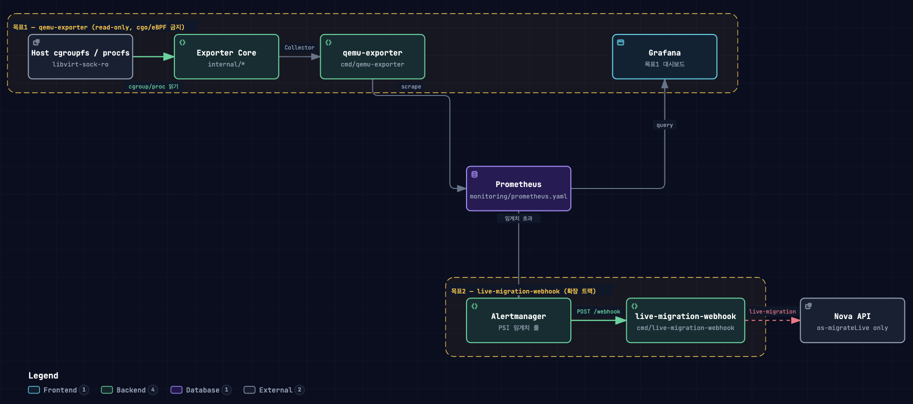

# qemu-exporter

> **A Lightweight, Read-Only Prometheus Exporter for QEMU Process Observability in OpenStack-Helm (OSH)**

`qemu-exporter` resolves the monitoring blind spot in OpenStack-Helm (OSH) environments by parsing host `cgroup` and `procfs` metrics (including kernel Pressure Stall Information - PSI) without modifying OpenStack, Libvirt, or Kubernetes code.

This repository has two tracks:

1. **qemu-exporter** (this document) — the exporter itself. Prototype for a 3-page undergraduate paper, submitted to KIPS ASK (`docs/Paper/`).
2. **[live-migration-webhook](#extension-track-live-migration-webhook)** — an extension that closes the loop: when the PSI contention metric exposed above crosses a threshold, Alertmanager fires a webhook that triggers a Nova live migration to preemptively evacuate the VM before resource exhaustion.

---

## Background & Motivation

This project originated during the **OpenSource Contribution Academy (OSSCA)** in South Korea while contributing to the OpenStack-Helm (OSH) Korean documentation. While analyzing OpenStack Nova's process execution lifecycle, a structural observability gap was identified in how Kubernetes and OpenStack manage VM workloads.

In OpenStack-Helm, OpenStack control plane components are deployed as Kubernetes Pods. When Nova creates a Virtual Machine (VM), `nova-compute` triggers `libvirtd` inside the `libvirt` pod to launch a QEMU process.

However, QEMU processes are placed under the host's root **`machine` cgroup (`machine.slice`)** instead of the pod cgroup hierarchy (**`kubepods.slice`**).

```text
[ Host Node ]
 ├── cgroup: kubepods.slice/  <-- Scraped by cAdvisor / kubelet
 │    └── pod: libvirt/
 └── cgroup: machine.slice/   <-- QEMU processes live here (Invisible to cAdvisor!)
      └── qemu-kvm (VMs)

```

### The Observability Gap

1. **Kubernetes (kubelet / cAdvisor):** Scrapes only `kubepods.slice`. Because QEMU runs under `machine.slice`, standard K8s monitoring fails to recognize VM resource utilization entirely (under-reporting host memory consumption by ~27%).
2. **OpenStack (libvirt API / `virsh domstats`):** Measures raw resource usage but fails to expose real-time resource contention. While libvirt exposes `vcpu.N.delay`, it is merely a cumulative counter and lacks support for Linux kernel Pressure Stall Information (PSI) standards and Prometheus node labels.

`qemu-exporter` bridges this gap by directly extracting kernel-level PSI and resource metrics via read-only access to host cgroups and procfs.

---

## Key Features

* **Zero Code Modification:** Requires no patches to OpenStack-Helm, Nova, Libvirt, or Kubernetes.
* **Kernel-Level Contention Metrics:** Extracts real-time Linux PSI (`cpu.pressure`) and runqueue wait times (`/proc//schedstat`).
* **Rich Metadata Enrichment:** Joins kernel/cgroup metrics with Nova instance metadata (`instance_id`, `instance_name`, `flavor`) and Kubernetes node labels.
* **Ultra-Low Overhead:** Implemented in Go, running as a Kubernetes DaemonSet with negligible resource impact (~0.11% CPU usage, ~10 MiB RAM).

---

## Architecture

The diagram below covers the full repository — the qemu-exporter path (top, 목표1) and the live-migration-webhook extension (bottom, [목표2](#extension-track-live-migration-webhook)) that consumes its PSI metric.



`qemu-exporter` itself operates in three non-intrusive stages:

```text
+-----------------------+     +-------------------------------------------------------+     +-------------------+
|     Host Targets      |     |                     qemu-exporter                     |     | Prometheus Server |
+-----------------------+     +-------------------------------------------------------+     +-------------------+
| 1. libvirt socket     | --> | [1. Identify] Resolve VM PIDs & locate cgroup path    |     |                   |
| 2. cgroup v2          | --> | [2. Collect] Parse memory.current, PSI & schedstat     | --> | Scrapes /metrics  |
| 3. procfs (/proc)     | --> | [3. Expose] Enrich with Nova metadata & Node labels   |     |                   |
+-----------------------+     +-------------------------------------------------------+     +-------------------+

```

1. **Identify Stage:** Connects to the host's read-only `libvirt` socket to retrieve active VM PIDs, then resolves their cgroup paths via `/proc//cgroup`.
2. **Collect Stage:** Directly reads `memory.current`, `cpu.pressure` (PSI), and `/proc//schedstat` (runqueue wait time).
3. **Expose Stage:** Attaches Nova metadata and node labels to the metrics and exposes them on the `/metrics` endpoint in Prometheus standard format.

---

## Feature Comparison

| Capabilities | libvirt (`virsh domstats`) | cAdvisor / kubelet | qemu-exporter (Proposed) |
| --- | --- | --- | --- |
| **VM Usage Metrics (CPU, Memory)** | **O** | **X** | **O** |
| **Real-time PSI & Contention Metrics** | **X** *(Cumulative `vcpu.N.wait,delay` only)* | **X** | **O** |
| **Nova Instance Metadata Mapping** | **O** | **X** | **O** |
| **Kubernetes Node Label Correlation** | **X** | **O** | **O** |
| **External Observability Integration** | **X** | **O** | **O** |

---

## Performance Overhead

Benchmark results on an AWS EC2 `m5.2xlarge` instance (Ubuntu 24.04 LTS):

| Resource | Host Total | `qemu-exporter` Peak Usage | Overhead |
| --- | --- | --- | --- |
| **CPU** | 8 vCPUs | ~0.009 Cores | **0.11%** |
| **Memory** | 32 GiB | ~10 MiB | **0.03%** |

---

## Exported Metrics

| Metric Name | Type | Description |
| --- | --- | --- |
| `openstack_vm_cpu_usage_seconds_total` | Counter | Cumulative CPU time consumed by the VM's QEMU process (cgroup `cpu.stat` `usage_usec`). |
| `openstack_vm_memory_usage_bytes` | Gauge | Current VM memory consumption (`memory.current`). |
| `openstack_vm_cpu_pressure_stall_seconds_total{type="some"}` | Counter | CPU Pressure Stall Information (`cpu.pressure` - some). |
| `openstack_vm_sched_runqueue_wait_seconds_total` | Counter | Cumulative runqueue wait time for the VM's vCPU threads (`/proc/<pid>/schedstat`, field 2, summed over threads). |
| `qemu_exporter_scrape_errors_total` | Counter | Cumulative count of per-domain or connection failures encountered while scraping. |
| `qemu_exporter_vms_discovered` | Gauge | Number of VMs successfully scraped in the most recent collection. |

### Metric Labels

The four `openstack_vm_*` metrics include the following enrichment labels:

* `node`: Host node hostname/identifier
* `instance_uuid`: OpenStack Nova instance UUID
* `instance_name`: Nova instance display name
* `flavor`: Nova instance flavor/type
* `project_id`: OpenStack project (tenant) UUID

`qemu_exporter_scrape_errors_total` and `qemu_exporter_vms_discovered` are exporter-level metrics and carry no labels.

---

## Quick Start

### Deployment via Kubernetes DaemonSet

Deploy `qemu-exporter` as a DaemonSet with read-only host volume mounts:

```yaml
apiVersion: apps/v1
kind: DaemonSet
metadata:
  name: qemu-exporter
  namespace: kube-system
spec:
  selector:
    matchLabels:
      app: qemu-exporter
  template:
    metadata:
      labels:
        app: qemu-exporter
    spec:
      hostNetwork: true
      containers:
      - name: qemu-exporter
        image: your-registry/qemu-exporter:latest
        securityContext:
          readOnlyRootFilesystem: true
        ports:
        - containerPort: 9100
          name: metrics
        volumeMounts:
        - name: sys-cgroup
          mountPath: /sys/fs/cgroup
          readOnly: true
        - name: proc
          mountPath: /proc
          readOnly: true
        - name: libvirt-sock
          mountPath: /var/run/libvirt/libvirt-sock-ro
          readOnly: true
      volumes:
      - name: sys-cgroup
        hostPath:
          path: /sys/fs/cgroup
      - name: proc
        hostPath:
          path: /proc
      - name: libvirt-sock
        hostPath:
          path: /var/run/libvirt/libvirt-sock-ro

```

---

## Extension Track: live-migration-webhook

`qemu-exporter` exposes contention (PSI) but does not act on it. **live-migration-webhook** closes that loop in a 2-node OpenStack-Helm environment: when `openstack_vm_cpu_pressure_stall_seconds_total{type="some"}` crosses a threshold, Alertmanager fires an alert carrying the VM's `instance_uuid`, a separate webhook receiver (`cmd/live-migration-webhook`) picks it up, and triggers a Nova live migration to preemptively evacuate the VM before it's performence is going down. See the bottom half of the [Architecture diagram](#architecture) above (목표2 box) for the exact call path.

* **Separate binary, separate rules.** `live-migration-webhook` does not share a binary with `qemu-exporter`, and it is the only part of this repo allowed to call OpenStack REST APIs (Nova, scoped strictly to the live-migration trigger — no other Nova operation).
* **Status:** experimentally validated end-to-end on a 2-node AWS testbed (`node-a`: control plane + qemu-exporter, `node-b`: compute-only). All 6 experiment stages (2-node provisioning → Nova multi-compute → manual migration → Alertmanager rule → webhook receiver → full scenario) completed successfully; instances are torn down between sessions (`make down`) to control cost.
* **Measured (full scenario, threshold-crossing to alert fired):** ~35.7s–75.7s depending on measurement convention (see raw data), alert-to-migration-complete ~37.3s.
* **Docs:**
  * [`live_migration_tdl.md`](live_migration_tdl.md) — experiment design, resume procedure, and stage-by-stage progress log (single source of truth for this track).
  * [`docs/paper_data/live_migration/README.md`](docs/paper_data/live_migration/README.md) — raw measurement data and result summary.

---